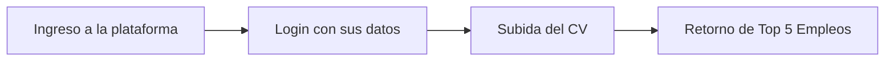
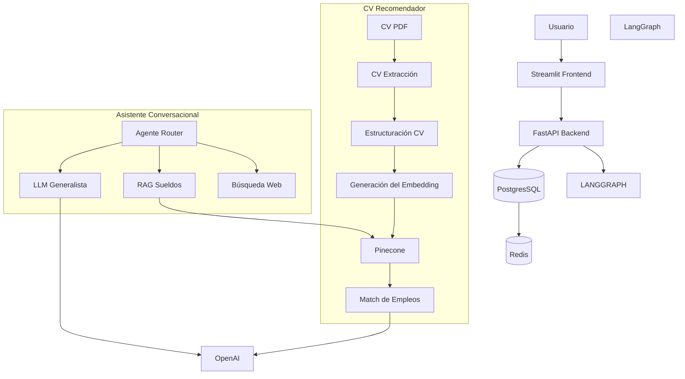
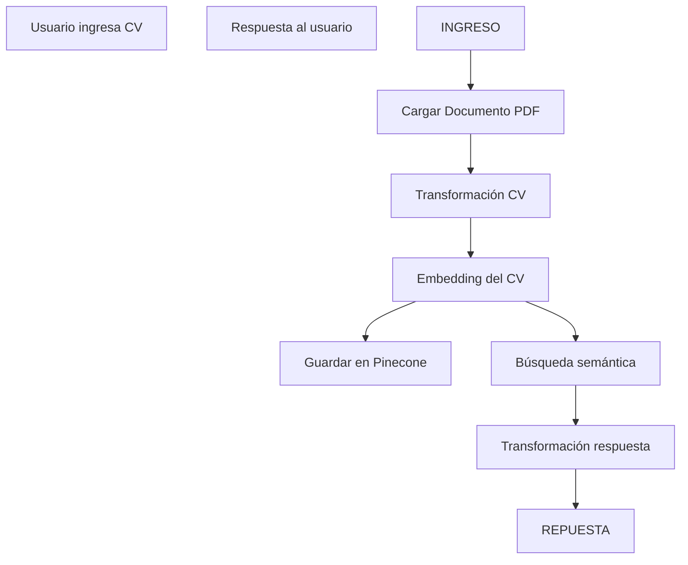
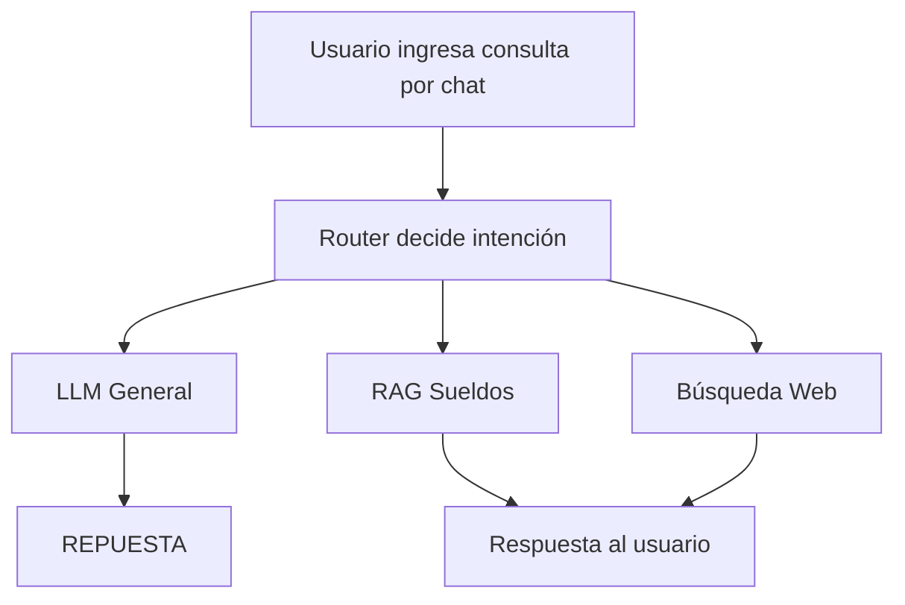
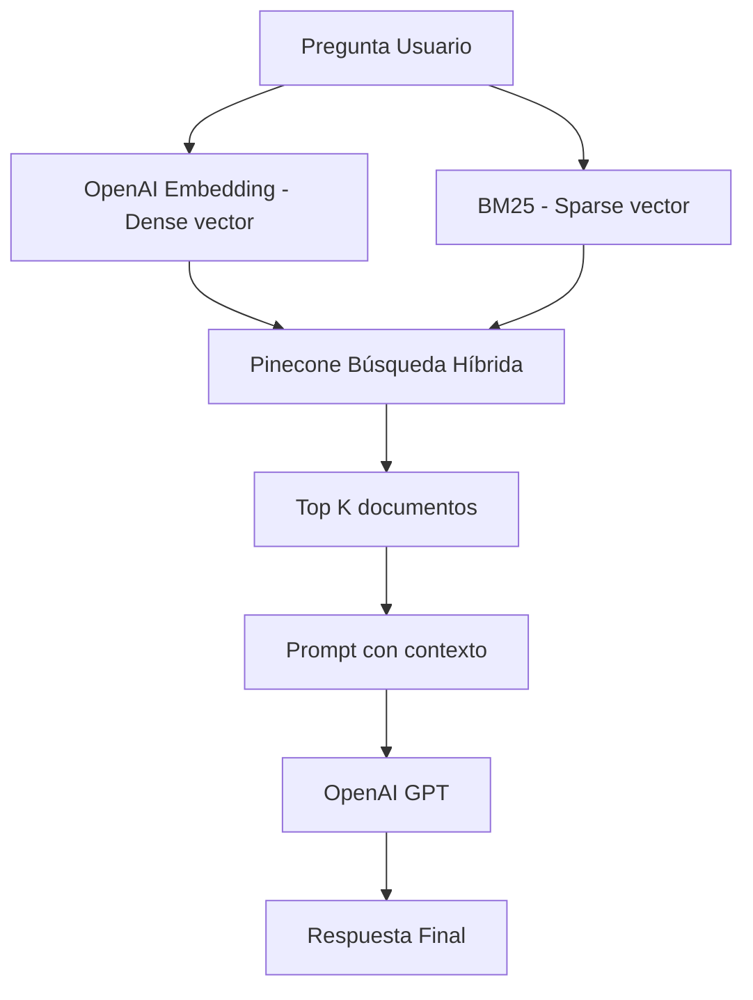
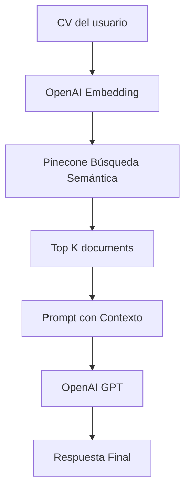

# Workflow Inteligente con LangGraph

> El sistema utiliza LangGraph para orquestar un flujo inteligente para evaluación automática de CVs, matching semántico de candidatos y asistencia al proceso de reclutamiento utilizando RAG y búsqueda vectorial.


## Tabla de Contenidos
- [Problema de Negocio](#problema-de-negocio)
- [Solución Propuesta](#solución-propuesta)
- [Demo en Producción](#demo-en-producción)
- [Funcionalidades Principales](#funcionalidades-principales)
- [Arquitectura del Sitema](#arquitectura-del-sistema)
- [Flujo End-to-End](#flujo-end-to-end)
- [Pipeline RAG](#pipeline-rag)
- [Stack Tecnológico](#stack-tecnológico)
- [Estructura del Repositorio](#estructura-del-repositorio)
- [Endpoints de la API](#endpoints-de-la-api)
- [Arquitectura de Despliegue](#arquitectura-de-despliegue)
- [Próximas Mejoras](#próximas-mejoras)

## Problema de Negocio

Para los candidatos les es muy difícil encontrar un match ideal a su perfil, es decir, adecuado a sus años de experiencia, funciones y habilidades técnicas. Es por ello que en la actualidad existen plataformas con varios filtros como palabras clave, años de experiencia, rango salarial, etc, los cuales reducen las opciones a unos cientos dependiendo del perfil a postular. Ahora el trabajo del postulante está en ingresar a cada una de esas decenas o cientos de empleos a revisar si calza su perfil adecuadamente y suele ser un proceso cansado y frustante sino encuentras algo adecuado a ti.

Para los reclutadores, los cuales no solo gestionan un proceso de reclutamiento sino varios a la vez, su indicador de idoniedad se basa por un lado en las ATS o la revisión rápida manual que hacen al CV del candidato, pero allí pierden oportunidad de crossear al candidato, el cual podría calificar para otro puesto que el reclutador también esté gestionando.

## Solución Propuesta

En vista de la realidad en ambos frente, este proyecto tiene por objetivo ser una plataforma centrada de búsqueda de empleo inteligente por el lado del candidato y a la vez una plataforma del talento humano por el lado de los reclutadores, utilizando el RAG como pilar en la optimización de esta problemática.

#### Por el frente del Candidato:
Reducir las horas de búsqueda de empleo a minutos, de la siguiente forma:
- Lista de empleos disponibles priorizados por Match al puesto.
- Feedback de mejoras o gaps que tiene el candidato frente a cada empleo disponible.
- Creación de CV optimizado para cada puesto.

#### Por el frente del Reclutador:
Reducir las horas de búsqueda del candidato ideal, de la siguiente forma:
- Lista de candidatos priorizados por Match al puesto gestionado.
- Recomendación de candidatos para otros puestos gestionados por el reclutador.
- Resumen de habilidades que el candidato no cumple para la idoniedad del puesto.
- Creación de feedback automático para el candidato para los que no sean elegidos.

## Demo en Producción

> [!NOTE]
> Por ahora solo se ha terminado con la funcionalidad de Recomendación de Empleos a través del CV del candidato (barra lateral izquierda), se está trabajando en la implementación de las siguientes funcionalidades.


## Funcionalidades Principales

| Funcionalidad | Descripción | Estado |
|---------------|-------------|--------|
| Recomendación Empleos | El usuario ingresa su CV y obtendrá como respuesta el top 5 empleos que hagan mayor match. | Implementado |
| Feedback de mejoras y gaps | El usuario además de recibir los top 5 empleos que hagan mayor match, recibe un feedback por cada uno enfocado en los gaps que le faltan para ser más idóneo al puesto | Implementado |
| Responder sobre salarios | La LLM usa como contexto una base vectorial con datos de salarios en distintos perfiles tech y administrativos en Perú. Devuelve rangos salariales y las empresas que los pagan | En Proceso |
| Responder sobre cosas nuevas | La LLM usa tools de búsqueda web para responder a preguntas que no se encuentran en su base de entrenamiento o sean eventos futuros para evitar la alucinación. | En Proceso |
| Recomendación Candidatos | El reclutador ingresa una palabra clave o descripción del perfil buscado y obtendrá como respuesta el top 5 candidadtos que hagan mayor match. | En Backlog |
| Creación de CV por cada puesto | El usuario tendrá la opción de generar un CV optimizado para el puesto que esté interesado antes de enviar su postulación | En Backlog |

## Arquitectura del Sistema

### Vista Funcional

**Vista candidato**


### Vista Técnica



## Flujo End-to-End

#### CV Recomendador


#### Asistente Conversacional


## Pipeline RAG

#### RAG Sueldos



#### RAG CV Match



## Stack Tecnológico

| Librería | Descripción |
|----------|---------|
| FastAPI | REST API Framework |
| Uvicorn | Servidor ASGI |
| Streamlit | Front interactivo |
| LangGraph | Orquestador |
| LangChain | LCEL + PromptTemplate |
| OpenAI | Generador de embeddings y LLM |
| Pinecone | Base vectorial y búsqueda híbrida o semántica |
| Docker | Creación de imágenes |
| PostgresSQL | Validación y creación de usuario |

## Estructura del Repositorio

```text

Proyecto
├── assets
│   └── demo.gif
├── backend
│   ├── core
│   │   ├── logging_config.py
│   │   ├── request_logger.py
│   │   └── security.py
│   ├── cvs
│   │   └── 20260604_221451_admin.pdf
│   ├── database.py
│   ├── graph
│   │   ├── graph_builder.py
│   │   └── react_graph_builder.py
│   ├── infra
│   │   ├── cache
│   │   └── db
│   ├── knowledge
│   │   ├── bm25_fit.pkl
│   │   ├── dense_vectors.pkl
│   │   ├── Sueldos_peru_incompleto_csv.csv
│   │   └── sueldos_peru.pkl
│   ├── llms
│   │   └── openaillm.py
│   ├── main.py
│   ├── memory
│   │   └── short_term.py
│   ├── nodes
│   │   ├── bm25_params.json
│   │   ├── cv_nodes.py
│   │   └── react_agent.py
│   ├── routers
│   │   ├── admin.py
│   │   └── agent.py
│   ├── schemas.py
│   ├── state
│   │   ├── react_state_graph.py
│   │   └── state_graph.py
│   ├── tools
│   │   └── web_search.py
│   └── utils
│       └── rag_utils.py
├── Dockerfile.api
├── Dockerfile.frontend
├── requirements.txt
└── ui
    ├── app.py
    ├── pages
    │   ├── Chat.py
    │   └── Login.py
    ├── streamlitui
    │   ├── display_results.py
    │   └── loadui.py
    ├── uiconfigfile.ini
    ├── uiconfigfile.py
    └── utils
        └── logger.py

```

## Endpoints de la API

| Método | Path | Descripción |
|--------|------|-------------|
| `POST` | `/auth/token` | Login para ingreso a la plataforma |
| `POST` | `/admin/create`| Creación de la cuenta del usuario en postgresql |
| `POST` | `/agent/cv-upload`| Inicia pipeline CV recomendador |
| `POST` | `/agent/general-query` | Inicia pipeline Asistente Conversacional | 

## Arquitectura de Despliegue

```mermaid
flowchart TD

    USUARIO[Usuario]
    EASYPANEL[EasyPanel VPS Contabo]
    FASTAPI[FastAPI Container]
    FRONTEND[Streamlit Container]
    POSTGRESSQL[(PostgresSQL Container)]
    OPENAI[OpenAI API]
    PINECONE[Pinecone Cloud]

    USUARIO --> EASYPANEL
    EASYPANEL --> FASTAPI
    EASYPANEL --> FRONTEND
    EASYPANEL --> POSTGRESSQL
    FASTAPI --> OPENAI
    FASTAPI --> PINECONE

    subgraph Contabo VPS
        EASYPANEL
        FASTAPI
        FRONTEND
        POSTGRESSQL

```

## Próximas Mejoras

- Responder sobre salarios
- Responder sobre cosas nuevas
- Recomendación candidatos
