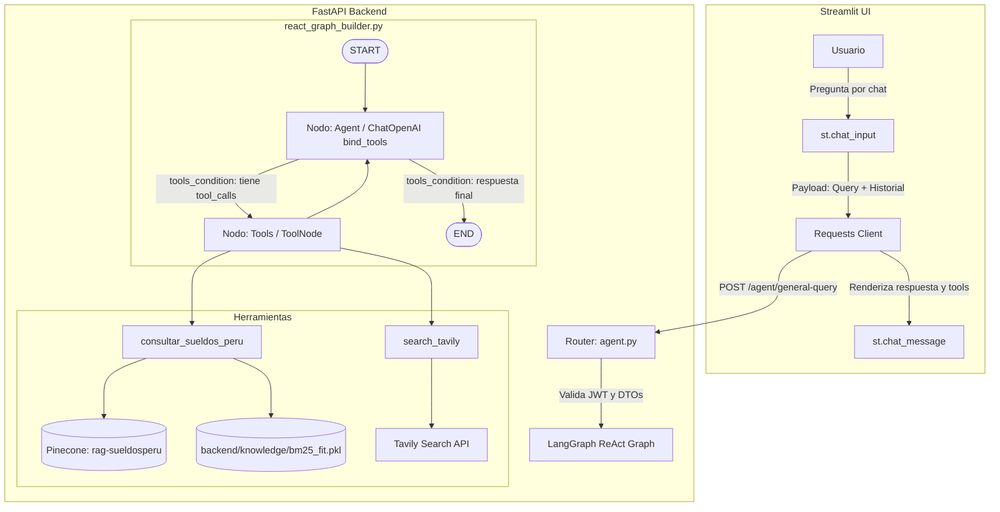

# Especificación de Diseño: Pipeline de Asistente Conversacional ReAct (LangGraph + RAG + Web)

**Fecha:** 2026-09-22  
**Estado:** Aprobado para Planificación  
**Autor:** Antigravity & davidrodriguez2712  

---

## 1. Visión General y Objetivos

El objetivo de esta especificación es completar y dejar 100% funcional el pipeline del asistente conversacional (**ReactAgent**) en el proyecto **ChambeaPe / CV Recomendador**.

El asistente permite a los usuarios interactuar a través de una interfaz de chat para resolver dudas salariales en el mercado peruano, buscar tendencias laborales o información de actualidad en la web, y recibir asesoría profesional personalizada sobre su perfil y CV.

### Requisitos y Decisiones Clave:
1. **Patrón Arquitectónico:** Agente ReAct autónomo con llamadas a herramientas (`ToolNode` y `tools_condition`), capaz de decidir dinámicamente si responder con su conocimiento general o consultar herramientas externas.
2. **Herramientas Integradas:**
   - `consultar_sueldos_peru`: Búsqueda híbrida (vector denso OpenAI + vector sparse BM25) sobre el índice Pinecone `rag-sueldosperu`.
   - `search_tavily`: Búsqueda web en tiempo real a través de la API de Tavily.
3. **Memoria Conversacional:** Desacoplada de Redis por ahora; gestionada en el frontend (`st.session_state`) y transportada en el payload de las solicitudes API hacia el estado de LangGraph.
4. **UI Integrada:** El chat de Streamlit interactúa en vivo con el endpoint `/agent/general-query`, coexistiendo con la funcionalidad existente de evaluación de CVs.

---

## 2. Arquitectura del Sistema



---

## 3. Componentes y Contratos de Datos

### 3.1. Estado de LangGraph (`backend/state/react_state_graph.py`)

Se utiliza la estructura estándar con el reductor `add_messages` para soportar turnos conversacionales, llamadas a herramientas (`AIMessage(tool_calls=...)`) y resultados de herramientas (`ToolMessage`):

```python
from typing import TypedDict, Annotated, Sequence, Optional
from langchain_core.messages import BaseMessage
from langgraph.graph.message import add_messages

class StateAgentReact(TypedDict):
    messages: Annotated[Sequence[BaseMessage], add_messages]
    user: Optional[str]
```

### 3.2. DTOs de API (`backend/schemas.py`)

Modelos de validación con Pydantic v2:

```python
class ChatMessageDTO(BaseModel):
    role: Literal["user", "assistant"]
    content: str

class GeneralQueryRequest(BaseModel):
    query: str
    history: List[ChatMessageDTO] = []

class GeneralQueryResponse(BaseModel):
    response: str
    tools_used: List[str] = []
```

### 3.3. Herramientas del Agente (`backend/tools/`)

#### 1. Herramienta de Sueldos: `consultar_sueldos_peru`
* **Ubicación:** `backend/tools/salary_tool.py` (o en `react_agent.py` exportada con `@tool`).
* **Entrada:** `consulta: str` (ej. "sueldo analista de datos").
* **Lógica:**
  - Carga `backend/knowledge/bm25_fit.pkl` usando `pathlib.Path(__file__).resolve().parent.parent / "knowledge" / "bm25_fit.pkl"`.
  - Genera sparse vector con `bm25.encode_queries(consulta)`.
  - Genera dense vector con `OpenAILLM().embedding_llm.embed_query(consulta)`.
  - Consulta Pinecone en el índice `rag-sueldosperu` (o mediante `HOST_SUELDOS` si está configurado en variables de entorno), con `top_k=5`.
  - Extrae y concatena `metadata['text']` de las coincidencias.
  - **Manejo de Errores:** Si Pinecone o BM25 fallan (por falta de red, credenciales o archivo ausente), captura la excepción y retorna un mensaje seguro: `"No fue posible acceder a la base salarial en este momento. Detalle: {e}"`.

#### 2. Herramienta de Búsqueda Web: `search_tavily`
* **Ubicación:** `backend/tools/web_search.py`.
* **Entrada:** `query: str`.
* **Lógica:**
  - Valida la existencia de `TAVILY_API_KEY`.
  - Invoca `TavilyClient.search(query=query, max_results=4, search_depth="basic")`.
  - Retorna un resumen concatenado de los fragmentos encontrados.
  - **Manejo de Errores:** En caso de fallo o cuota agotada, retorna `"No se pudo completar la búsqueda en la web. Detalle: {e}"`.

### 3.4. Constructor del Grafo (`backend/graph/react_graph_builder.py`)

* Configura el modelo:
  ```python
  tools = [search_tavily, consultar_sueldos_peru]
  llm_with_tools = OpenAILLM().llm.bind_tools(tools)
  ```
* Define el system prompt del agente:
  - Asesor laboral experto para el mercado peruano.
  - Instrucciones explícitas de usar `consultar_sueldos_peru` cuando pregunten por salarios o rangos salariales en Perú.
  - Instrucciones explícitas de usar `search_tavily` cuando pregunten por noticias recientes, empresas específicas no encontradas o hechos de actualidad.
  - Tono motivador, cordial y siempre proponiendo un paso siguiente accionable.
* Nodos:
  - `agent`: Invoca `llm_with_tools.ainvoke(messages)`.
  - `tools`: `ToolNode(tools)`.
* Aristas:
  - `START` $\rightarrow$ `agent`
  - `agent` $\rightarrow$ condicional `tools_condition` $\rightarrow$ si `tools` va a `tools`, si no a `END`.
  - `tools` $\rightarrow$ `agent`.

### 3.5. Endpoint API (`backend/routers/agent.py`)

* Ruta: `POST /agent/general-query`
* Dependencias: `user_dependency` (autenticación JWT requerida).
* Cuerpo: `GeneralQueryRequest`.
* Transforma `history` a objetos LangChain (`HumanMessage`, `AIMessage`).
* Invoca el grafo con `ainvoke({"messages": input_messages, "user": user.get("user")})` usando un `recursion_limit=10`.
* Extrae el contenido final y las herramientas invocadas durante la ejecución.
* Retorna `GeneralQueryResponse`.

### 3.6. Frontend Streamlit (`ui/pages/Chat.py`)

* Maneja el estado conversacional en `st.session_state.chat_messages`.
* Muestra el historial completo en pantalla con `st.chat_message("user")` y `st.chat_message("assistant")`.
* Al ingresar un mensaje en `st.chat_input`:
  1. Agrega y muestra inmediatamente el mensaje del usuario.
  2. Envía la petición con `requests.post` a `{API_URL}/agent/general-query` con cabecera `Authorization: Bearer {token}`.
  3. Muestra la respuesta en pantalla y la añade a la sesión.
  4. Si se usaron herramientas, muestra una insignia informativa (ej. `🔍 Búsqueda Web` / `💼 Consulta Salarial`).
* Mantiene intacta la funcionalidad existente en la barra lateral para evaluación de CV en PDF.

---

## 4. Correcciones de Seguridad y Deuda Técnica Previa

Para asegurar que todo el flujo funcione sin bloqueos:
1. **Reactivar verificación de contraseñas:** En `backend/core/security.py`, descomentar y asegurar la verificación de `pwd_context.verify(data.password, user.hashed_password)` en el endpoint `/auth/token`.
2. **Corregir validación de rol de admin:** En `backend/routers/admin.py`, validar `user.get("user")` en lugar de `user_form.user`.

---

## 5. Estrategia de Pruebas y Criterios de Aceptación

### Criterios de Aceptación:
1. **Prueba General:** Una pregunta como *"¿Cómo estructurar la sección de experiencia de mi CV?"* responde directamente como asesor laboral sin invocar herramientas.
2. **Prueba Salarios:** Una pregunta como *"¿Cuánto gana un Data Engineer Senior en Perú?"* invoca `consultar_sueldos_peru` y devuelve un rango basado en los datos de Pinecone/BM25.
3. **Prueba Web:** Una pregunta de actualidad o de empresas específicas invoca `search_tavily` y cita la información encontrada.
4. **Resistencia a Fallos:** Si Pinecone o Tavily no tienen credenciales válidas o fallan, el agente no lanza un error 500 al cliente, sino que explica la situación amablemente.
5. **Historial de Conversación:** Preguntas de seguimiento (ej. *"¿Y qué requisitos suelen pedir para ese puesto?"*) mantienen el hilo del contexto conversacional inmediato.
